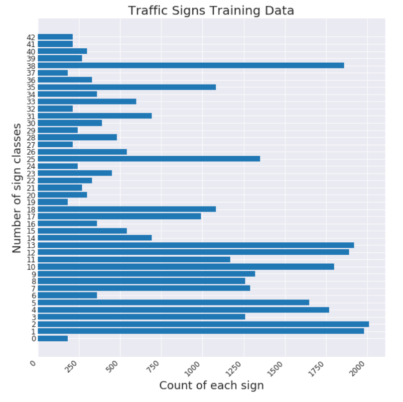
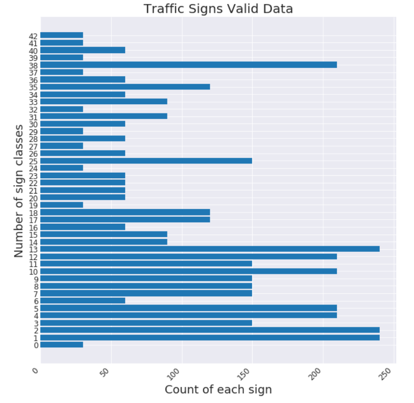
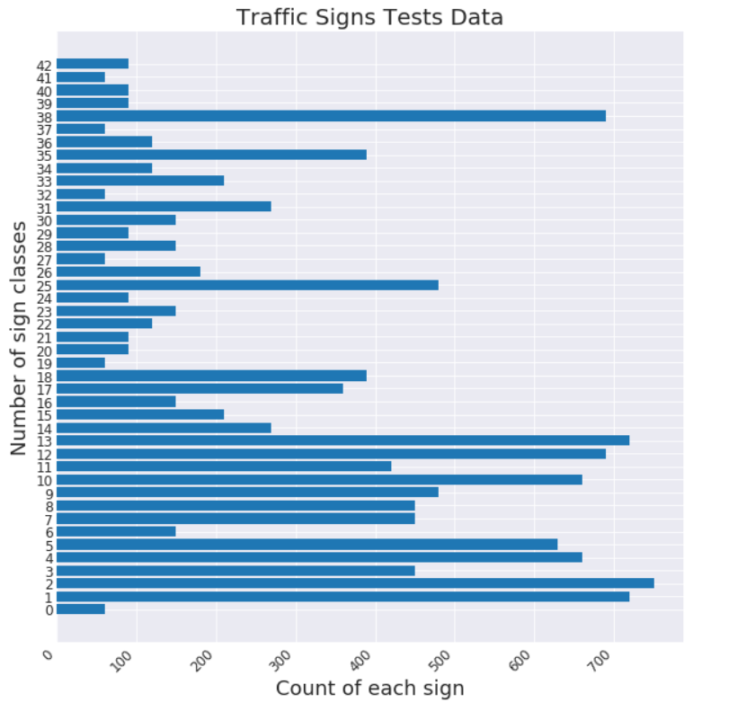
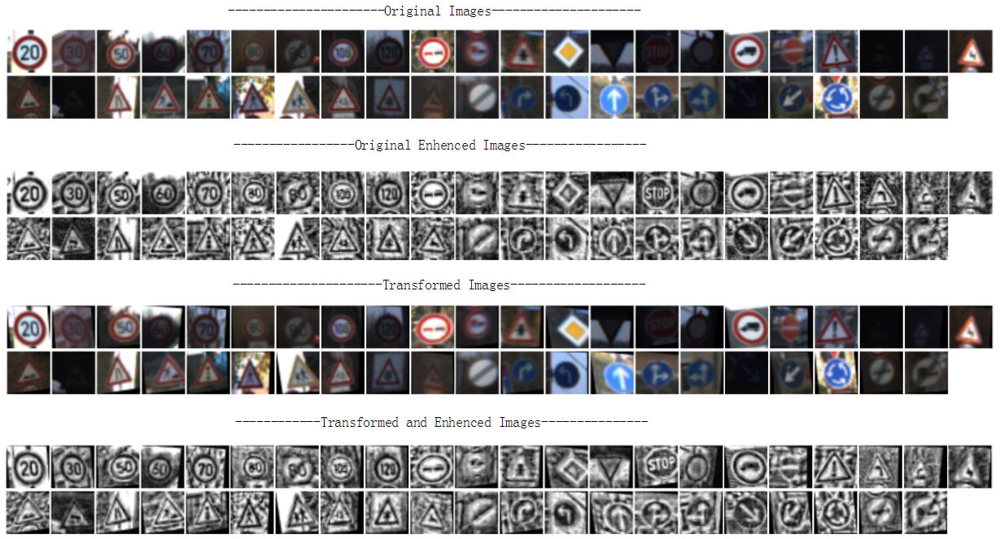
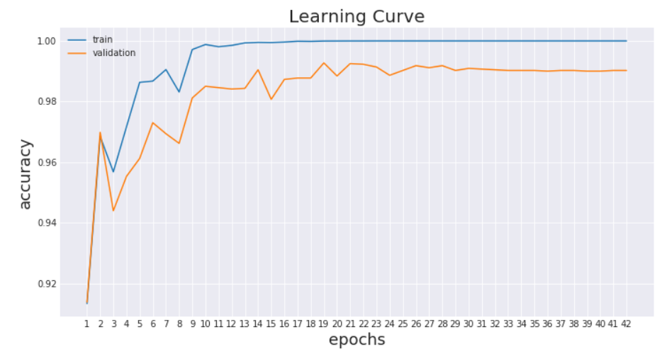
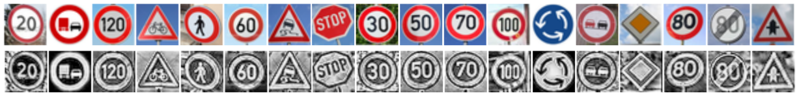
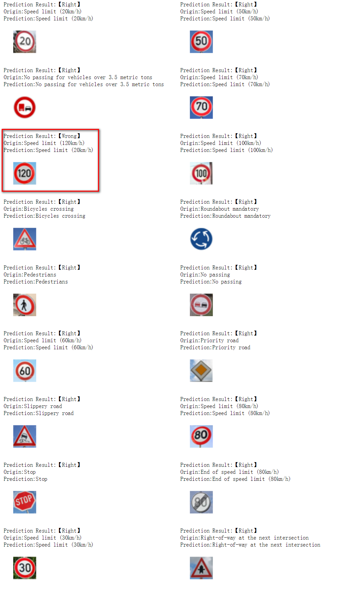
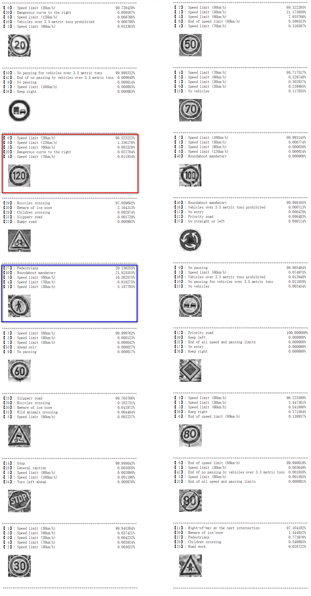
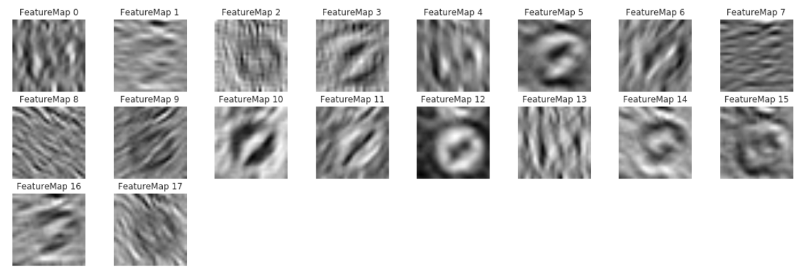
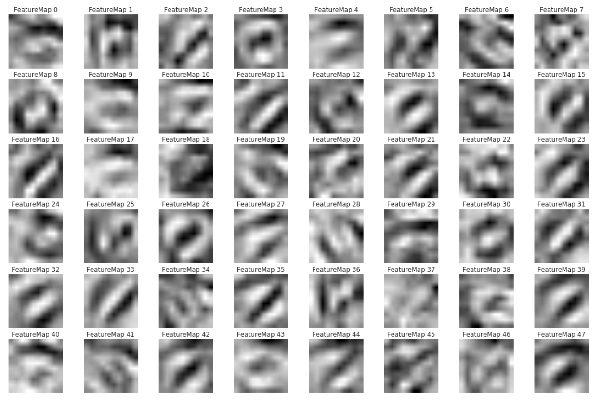

[TOC]

# **Traffic Sign Recognition** 

---

**Build a Traffic Sign Recognition Project**

The goals / steps of this project are the following:

- Load the data set (see below for links to the project data set)
- Explore, summarize and visualize the data set
- Design, train and test a model architecture
- Use the model to make predictions on new images
- Analyze the softmax probabilities of the new images
- Summarize the results with a written report


[//]: # (Image References)

[image1]: ./writeup_res/conv1_feature_map.png "conv1_feature_map"
[image2]: ./writeup_res/conv2_feature_map.png "conv2_feature_map"
[image3]: ./writeup_res/learning_rate_curve.png "learning_rate_curve"
[image4]: ./writeup_res/preprocessed.png "preprocessed"
[image5]: ./writeup_res/show_all_classes.png "show_all_classes"
[image6]: ./writeup_res/show_all_processed_classes.png "show_all_processed_classes"
[image7]: ./writeup_res/Test_result_with_accuracy.png "Test_result_with_accuracy"
[image9]: ./writeup_res/Test_result.png "Test_result"
[image10]: ./writeup_res/test_data_summary.png "test_data_summary"
[image11]: ./writeup_res/train_data_summary.png "train_data_summary"
[image12]: ./writeup_res/valid_data_summary.png "valid_data_summary"

## Rubric Points

Here I will consider the [rubric points](https://review.udacity.com/#!/rubrics/481/view) individually and describe how I addressed each point in my implementation.  
You're reading it! and here is a link to my [project code](https://github.com/dongkesi/CarND-Traffic-Sign-Classifier-Project/blob/master/Traffic_Sign_Classifier.ipynb)
---

### 1. Data Set Summary & Exploration

#### 1.1. Data Set Summary.

Signs data set:

* The size of training set is 34799
* The size of the validation set is 4410
* The size of test set is 12630
* The shape of a traffic sign image is (32, 32, 3)
* The number of unique classes/labels in the data set is 43

#### 1.2. Exploration.

The visualization of the training valid and test data set. It is a bar chart showing data distribution. We can see that the dataset is unbalanced.

   

#### 1.3. Show All Class Images

I plot a bunch of random images every class. These images vary greatly in brightness and contrast, so I need to do some preprocess. 


### 2. Design and Test a Model Architecture

#### 2.1. preprocess

According to [this paper](http://yann.lecun.com/exdb/publis/pdf/sermanet-ijcnn-11.pdf), grayscale is better than color images, so I convert images to grayscale and adjust them by Histogram equalization.

```python
def enhence_single_image(image):
    x = 0.299 * image[:, :, 0] + 0.587 * image[:, :, 1] + 0.114 * image[:, :, 2]
    x = (x / 256.).astype(np.float32)
    with warnings.catch_warnings():dis
        warnings.simplefilter("ignore")
        x = (exposure.equalize_adapthist(x) - 0.5)
    x = x.reshape(x.shape + (1,))
    return x

def enhence_images(images):
    images_out = np.empty((images.shape[0],images.shape[1],images.shape[2],1)).astype(np.float32)
    with tqdm(total=images.shape[0]) as pbar:
        for idx, image in enumerate(images):
            images_out[idx] = enhence_single_image(image)
            pbar.update(1)
    return images_out

def preprocess(x, y):
    x_enhence, y_enhence = enhence_images(x), y
    return x_enhence, y_enhenc
```


#### 2.2. Augument

When I first trained the model, the valid accuracy was always lower than training accuracy even if I used regularization methods. So I decide to increase the number of images. The original dataset is unbalanced, but I also find that test and valid datasets have same unbalanced distribution, so I only double the train data on every class by making a little tranform base on original data.

```python
def transform_images(images):
    num_images = images.shape[0]
    d = 0.15
    base_row = tf.constant([1, 0, 0, 0, 1, 0, 0, 0], shape=[1, 8], dtype=tf.float32)
    base = tf.tile(base_row, [num_images, 1])   
    angles = tf.random_uniform([num_images, 8], maxval=d, minval=-d)
    mask_row = tf.constant([1, 1, 1, 1, 0, 0, 0, 0], shape=[1, 8], dtype=tf.float32)
    mask = tf.tile(mask_row, [num_images, 1])
    angles = base + angles * mask
    transforms = tf.contrib.image.compose_transforms(angles)
    trans_images = tf.contrib.image.transform(images, transforms, interpolation='BILINEAR')
    with tf.Session() as sess:
        out = sess.run(trans_images)
    return out

def augment_images(x, y, stretch_factor=1, stretch=True, size=None):
    x = (x).astype(np.float32)
    x_ext = np.empty((0, x.shape[1], x.shape[2], x.shape[3]), dtype=np.float32)
    y_ext = np.empty((0), dtype=y.dtype)
    x_ext = np.append(x_ext, x, axis=0)
    y_ext = np.append(y_ext, y, axis=0)
    classes, class_counts = np.unique(y, return_counts = True)
    n_classes = classes.size
    max_c = max(class_counts)
    total = max_c if size is None else size
    with tqdm(total=n_classes) as pbar:
        for c, cnt in zip(classes, class_counts):
            if stretch:
                total = stretch_factor * cnt
            if total - cnt > 0:
                indices = np.random.choice(sum(y==c), total-cnt)
                x_ = x[y==c][indices]
                x_ = transform_images(x_)
                y_ = y[y==c][indices]
                x_ext = np.append(x_ext, x_, axis=0)
                y_ext = np.append(y_ext, y_, axis=0)
            else:
                continue
            pbar.update(1)
    return x_ext, y_ext
```

Here is an example of a traffic sign image before and after tranform and grayscaling.



#### 2.3. Net Model

My final model consisted of the following layers:

| Layer         		|     Description	        					| 
|:---------------------:|:---------------------------------------------:| 
| Input         		| 32x32x1 Grayscale image  						| 
| Convolution 5x5     	| 1x1 stride, valid padding, outputs 28x28x18 	|
| RELU					|												|
| Max pooling(1)      	| 2x2 stride,  outputs 14x14x18 				|
| Dropout(1)			| 0.8											|
| Convolution 5x5	    | 1x1 stride, valid padding, outputs 10x10x18	|
| batch_normalization   | 												|
| RELU					|												|
| Max pooling(2)      	| 2x2 stride,  outputs 5x5x48	 				|
| Dropout(2)			| 0.7											|
| Fully connected		| Max pooling(Dropout(1)) -> [7x7x18] +	Dropout(2) <br> flat, inputs 2082, outputs 360	|
| batch_normalization   | 												|
| RELU					|												|
| Dropout(2)			| 0.6											|
| Fully connected		| inputs 360, outputs 252						|
| batch_normalization   | 												|
| RELU					|												|
| Dropout(2)			| 0.5											|
| Fully connected		| inputs 252, outputs 43						|
| Softmax				| 	        									|

```python
def net(x, is_training=True, scale=1):
 
    with tf.variable_scope("conv1"):
        conv1 = conv2d(x, 5, 1, 6*scale)
        conv1 = activation(conv1)
        pool1 = max_pool(conv1, 2)   
        pool1 = tf.cond(is_training, lambda: tf.nn.dropout(pool1, 0.8), lambda: pool1)
        
    with tf.variable_scope("conv2"):
        conv2 = conv2d(pool1, 5, 1, 16*scale)
        conv2 = tf.layers.batch_normalization(conv2, training=is_training)
        conv2 = activation(conv2)
        pool2 = max_pool(conv2, 2)
        pool2 = tf.cond(is_training, lambda: tf.nn.dropout(pool2, 0.7), lambda: pool2)
        
        
    pool1 = max_pool(pool1, 2)
    flat1 = tf.contrib.layers.flatten(pool1)
    flat2 = tf.contrib.layers.flatten(pool2)
    flat = tf.concat([flat1, flat2], 1)
    
    with tf.variable_scope("fc1"):
        fc1 = fully_connneted(flat, 120*scale)
        fc1 = tf.layers.batch_normalization(fc1, training=is_training)
        fc1 = activation(fc1)
        fc1 = tf.cond(is_training, lambda: tf.nn.dropout(fc1, 0.6), lambda: fc1)
        
    with tf.variable_scope("fc2"):
        fc2 = fully_connneted(fc1, 84*scale)
        fc2 = tf.layers.batch_normalization(fc2, training=is_training)
        fc2 = activation(fc2)
        fc2 = tf.cond(is_training, lambda: tf.nn.dropout(fc2, 0.5), lambda: fc2)
       
    logits = fully_connneted(fc2, n_classes)
    
    return logits
```

#### 2.4. Regularization

I use following regularization techniques for decreasing overfit.

- L2
- Batch Normaliztion, it has a lot [benefits](https://github.com/dongkesi/deep-learning-homework/blob/master/tutorials/batch-norm/Batch_Normalization_Lesson.ipynb).
- Dropout
- Early stopping
 
#### 2.5. Training

```python
BATCH_SIZE = 128
EPOCHS = 100
learning_rate = [0.005, 0.003, 0.001, 0.0007, 0.0005, 0.0003, 0.0001,\
				 0.00007, 0.00005, 0.00003, 0.00001, 0.000005]
```

To train the model, I used an learning rate decay and early stopping. If two consecutive data is lower the best one before, I make the learning rate decay. If the learning rate have gone to the lowest one I defined and then valid accuracy is 10 consecutive times lower than the best accuracy, trigger early stopping.


#### 2.6. Approach Iteration

I take many trails on this Net.
**【S1】** I start from LeNet. Validation Accuracy:  0.904762.
**【S2】** Double all convolution depths and fully connnet layer ouput units. Validation Accuracy:  0.936735
**【S3】** Double again. Validation Accuracy:  0.929252, become bad.
**【S4】** Add dropout after every layer. Validation Accuracy:  0.965079.
**【S5】** Multi-Scale Features, branch out the output of first convolution layer and feed to fully connect layer. Validation Accuracy:  0.969615.
**【S6】** Add L2. Validation Accuracy:  0.962812. It become bad again, but I keep it.
**【S7】** Augment train data. Validation Accuracy:  0.983673.
**【S8】** Learning rate decay and make convolution depths and fully connect layer output units down to triple of original LeNet. Validation Accuracy:  0.990249.

My final model results were:

* training set accuracy of 100%
* validation set accuracy of 99.0249%
* test set accuracy of 97.9097%



Actually I get a higher validation accuracy on the training processing before early stopping, I think restore the model to that point is better. 


### 3. Test a Model on New Images

#### 3.1. Show Test Image.

Here are 18 German traffic signs that I found on the web:



#### 3.2. Prediction

Here are the results of the prediction.



The model was able to correctly guess 17 of the 18 traffic signs, which gives an accuracy of 94.4444%. The red box selected sign has wrong prediction. That sign is very clear in fact, but it failed. It was predicted as Speed limit (20km/h). My test images are all have watermark, it might be a cause.

#### 3.3. Top 5 softmax Probabilities




### 4. Visualizing the Neural Network

#### 4.1. Convolution Layer 1



#### 4.2. Convolution Layer 2

